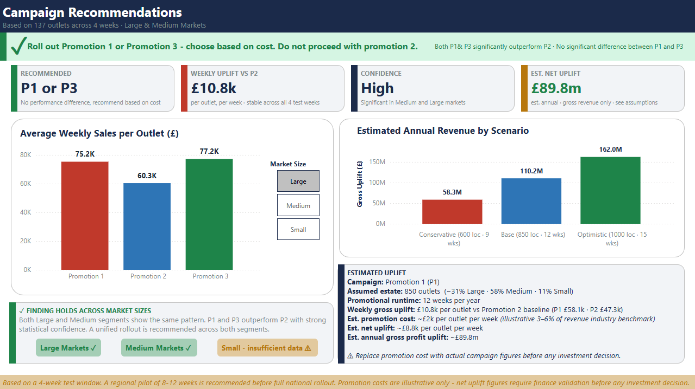

# Fast Food Marketing Campaign: A/B/C Test Analysis

Three promotional campaigns tested across 137 fast food outlets over four weeks. The goal was to identify which promotion to roll out nationally, and whether a single recommendation could apply across all market sizes.

Dataset: [Fast Food Marketing Campaign](https://www.kaggle.com/datasets/chebotinaa/fast-food-marketing-campaign-ab-test) via Kaggle.

## Approach

Market size (Small, Medium, or Large) already has a clear effect on sales before any promotions are involved, so promotions were compared within each size category separately rather than together. For Large and Medium markets, statistical tests (Mann-Whitney U) were run between each pair of promotions, with Bonferroni correction applied to account for running multiple tests, and rank-biserial correlation used to measure how strong each difference was. Small markets didn't have enough data to be reliable, so they were excluded from the recommendation.

## Results

| | P1 vs P2 | P1 vs P3 | P2 vs P3 |
|---|---|---|---|
| **Large** | ✓ r=0.625 | ✗ r=0.190 | ✓ r=0.760 |
| **Medium** | ✓ r=0.568 | ✗ r=0.190 | ✓ r=0.494 |

Both segments return identical conclusions. Performance gaps were stable across all four test weeks, confirming the promotion effect persists beyond the initial launch period. Effect sizes (r) represent the difference in probability that an outlet from one group outsells an outlet from the other, minus the reverse: r<0.1 is negligible, 0.1-0.3 small, 0.3-0.5 medium,  >0.5 large.

## Recommendation
Eliminate Promotion 2. Roll out Promotion 1 or Promotion 3 based on cost or operational factors as there is no statistically significant difference between them in either Medium/Large markets.

Estimated gross revenue uplift of £10.8k per outlet per week against the P2 baseline, equating to ~£110m annually under a base scenario of 850 outlets across 12 promotional weeks. Net uplift ~£89.8m after illustrative promotion costs (~£2k per outlet per week, derived from a 3-6% of revenue industry benchmark. Replace with actual figures before any investment decision).

Recommend a 8-12 week regional pilot before full national rollout.

## Screenshots

